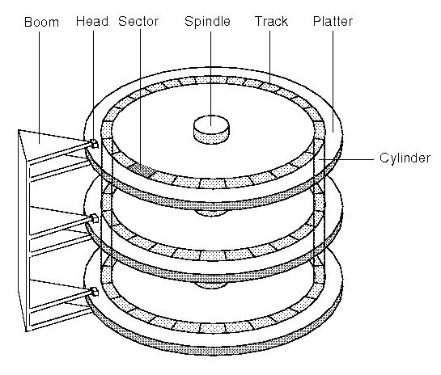

## 章节三 基于GRUB启动

### boot 是怎样工作的？

当 X86 电脑开机后，经过一个复杂的阶段后，控制权将交给内核的 "main" 入口 (`kmain()`)。 在本章中，我们仅仅了解BIOS引导的方式，不关注 [UEFI (统一可扩展固件接口)](http://baike.baidu.com/item/UEFI)。

BIOS启动的过程是：RAM detection(RAM检测) -> Hardware detection/Initialization （硬盘检测）-> Boot sequence（启动顺序）.

最重要的一步是"Boot sequence"（启动顺序）， BIOS在此阶段结束后将尝试交换控制权到下个阶段的bootloader（引导程序）。

在"Boot sequence"阶段，BIOS将选择一个"boot device"（启动设备），比如floppy disk（闪存）, hard-disk（硬盘）, CD, USB flash memory device（USB设备） 或者 network（网络）。我们的操作系统将从硬盘初始化启动，当然以后也可以从CD，USB介质启动。 判断设备是否能够引导，还需校验该设备是否包含Master Boot Record (MBR：主引导记录），校验手法是判断偏移第511字节为`0x55`，第512字节为`0xAA`，这两个字节二进制表示为 `0b1010101001010101`，如果这两个字节不等于 `0xAA55`，则该设备不能被引导。
>注：此处使用交替位模式，来防止某些驱动器或控制器错误，任何错误引起的位篡改都将导致无法正常引导。
>A:1010
>5:0101


BIOS搜寻引导设备的方式是从每个设备的引导区加载前512字节到物理内存的 [`0x7C00`](http://www.glamenv-septzen.net/en/view/6) 处。 当上述的标志校验通过后，BIOS通过跳转执行`0x7C00`的引导区代码，从而交换控制权。

此时的CPU还是运行在16位模式（X86向后兼容的特性）。为了执行我们的32位内核，引导程序必须切换CPU到保护模式下。

译者注：对boot做精确的中文定义是比较难的，大部分翻译为引导或启动。

#### GRUB是什么?

> GNU GRUB（简称“GRUB”）是一个来自GNU项目的启动引导程序。GRUB是`多启动规范`的实现，它允许用户可以在计算机内同时拥有多个操作系统，并在计算机启动时选择希望运行的操作系统。GRUB可用于选择操作系统分区上的不同内核，也可用于向这些内核传递启动参数。.

简而言之，GRUB就是用来启动后加载存储在硬盘上的内核。


#### 为何使用GRUB?

* GRUB易于使用
* 可以直接用来加载32位内核
* 支持多系统引导(Multiboot with Linux, Windows and others)
* 易于加载额外模块到内存

#### 如何使用GRUB?

GRUB使用 `多启动规范`,被其加载执行的二进制执行文件应该是32位并且前8192字节必须包含指定的multiboot header（多启动规范头）。我们的内核是 `ELF` 执行文件，`ELF` 是大多数UNIX系统下的标准执行文件格式。

我们内核的第一启动顺序由汇编写成：[start.asm](https://github.com/SamyPesse/How-to-Make-a-Computer-Operating-System/blob/master/src/kernel/arch/x86/start.asm) ，并使用链接器链接到我们的内核结构体上：[linker.ld](https://github.com/SamyPesse/How-to-Make-a-Computer-Operating-System/blob/master/src/kernel/arch/x86/linker.ld)

译者注：
让我们深入了解下链接脚本 `linker.ld`

链接脚本主要用于规定如何把输入文件内的`section`放入输出文件内, 并控制输出文件内各部分在程序地址空间内的布局
```
/* 定义输出文件的格式 */
OUTPUT_FORMAT(elf32-i386)
/* 设置输出文件的machine architecture(体系结构) */
OUTPUT_ARCH(i386)
/* 入口地址(entry point): 进程执行的第一条用户空间的指令在进程地址空间的地址 ，将符号_start的值设置成入口地址 */
ENTRY (_start)

SECTIONS{
   /* 据说是grub规定内核必须被加载到1M以上的内存  0x00100000为1 MiB.
	* 个人猜测：通电后，cpu开始从0地址执行命令，由于我们需要通过grub引导我们的内核启
	* 动，所以必然要有一段指令将我们的grub加载到内存中运行，这可能就是预留前1M内存空
	* 间的原因
	*/
    . = 0x00100000;

	/* 代码区 */
    .text :{
        *(.text)
    }

	.data ALIGN (0x1000) : {
	   start_ctors = .;
	   *(.ctor*)
	   end_ctors = .;
	   start_dtors = .;
	   *(.dtor*)
	   end_dtors = .;
	   *(.data)
	}

	/* 只读数据 4K对齐 */
    .rodata ALIGN (0x1000) : {
        *(.rodata)
    }

	/* 数据(已被初始化) 4K对齐 */
    .data ALIGN (0x1000) : {
        *(.data)
    }

	/* 数据（未被初始化) 和栈 */ 
    .bss : {
        sbss = .;
        *(COMMON)
        *(.bss)
        ebss = .;
    }
}
```

引导程序也初始化一些`C++运行时`，在后面的章节中将有所描述。

`Multiboot`多协议规范头结构体：

```cpp
struct multiboot_info {
	u32 flags;
	u32 low_mem;
	u32 high_mem;
	u32 boot_device;
	u32 cmdline;
	u32 mods_count;
	u32 mods_addr;
	struct {
		u32 num;
		u32 size;
		u32 addr;
		u32 shndx;
	} elf_sec;
	unsigned long mmap_length;
	unsigned long mmap_addr;
	unsigned long drives_length;
	unsigned long drives_addr;
	unsigned long config_table;
	unsigned long boot_loader_name;
	unsigned long apm_table;
	unsigned long vbe_control_info;
	unsigned long vbe_mode_info;
	unsigned long vbe_mode;
	unsigned long vbe_interface_seg;
	unsigned long vbe_interface_off;
	unsigned long vbe_interface_len;
};
```
通过使用命令 ```mbchk kernel.elf``` 来检验 kernel.elf 文件是否符合`multiboot`标准，也可以通过命令 ```nm -n kernel.elf``` 校验ELF二进制文件不同对象的偏移量。

#### 创建内核和GRUB磁盘镜像

译者注：
首先读者应该了解下磁盘相关的知识：



> 
磁道：Track，可以理解为一个圆形盘片由许许多多的同心圆组成，每一个同心圆可以认为是一个磁道。（硬盘是一个高速旋转的东西，当磁盘旋转时，磁头若保持在一个位置上不动，则磁头会在磁盘表面划出一个圆形轨迹，这些圆形轨迹就叫做磁道）
>
扇区：Sector，可以联想到“扇形区域”，磁盘上的每个磁道被等分为若干个弧段，这些弧段便是磁盘的扇区，每个扇区的大小为512个字节，磁盘驱动器在向磁盘读取和写入数据时应该以扇区为单位。
>
柱面：Cylinder，硬盘通常由重叠的一组盘片构成，每个盘面都被划分为数目相等的磁道，并从外缘的0开始编号，具有相同编号的磁道形成一个圆柱，称之为磁盘的柱面。显然，磁盘的柱面数与一个盘面上的磁道数是相等的。
>
磁头：Head，当然是读取信息用的了。每个盘面都有自己的磁头，如果盘面的双面都记录信息，那么双面都应该有磁头。所以，硬盘的容量计算公式如下：硬盘的容量=柱面数×磁头数×扇区数×512（字节数）


脚本 [diskimage.sh](https://github.com/SamyPesse/How-to-Make-a-Computer-Operating-System/blob/master/src/sdk/diskimage.sh) 可以生成一个给QEMU使用的磁盘镜像。

##### 下面是该脚本的部分解释：
首先使用 ```qemu-img``` 创建硬盘镜像(c.img)：
```
qemu-img create c.img 2M
```

接下来使用 ```fdisk``` 给磁盘分区:
```bash
fdisk ./c.img

# Switch to Expert commands 专家命令模式
> x

# Change number of cylinders (1-1048576) 设置柱面数量
> c
> 4

# Change number of heads (1-256, default 16): 设置磁头数量
> h
> 16

# Change number of sectors/track (1-63, default 63) 设置每个磁道的扇区数量
> s
> 63

# Return to main menu 返回主菜单
> r

# Add a new partition 增加新的分区
> n

# Choose primary partition 设置为主分区
> p

# Choose partition number 设置分区号
> 1

# Choose first sector (1-4, default 1) 设置起始扇区
> 1

# Choose last sector, +cylinders or +size{K,M,G} (1-4, default 4) 设置分区大小为整个磁盘
> 4

# Toggle bootable flag 切换启动标志
> a

# Choose first partition for bootable flag 设置第一分区为引导区
> 1

# Write table to disk and exit 写入
> w
```

现在需要使用 ```losetup``` 连接镜像`c.img`为loop-device（伪设备），伪设备能使我们像块设备一样访问一个文件。 losetup需要传入一个分区偏移量参数，该参数可以通过 **offset= start_sector * bytes_by_sector** 计算得到。

使用 ```fdisk -l -u c.img```, 将得到: 63 * 512 = 32256.
```
# fdisk -l -u c.img            
You must set cylinders.
You can do this from the extra functions menu.

Disk c.img: 0 MB, 0 bytes
16 heads, 63 sectors/track, 0 cylinders, total 0 sectors
Units = sectors of 1 * 512 = 512 bytes
Sector size (logical/physical): 512 bytes / 512 bytes
I/O size (minimum/optimal): 512 bytes / 512 bytes
Disk identifier: 0xe8c36f7f

Device Boot      Start         End      Blocks   Id  System
c.img1   *          63        4031        1984+  83  Linux
```

```bash
losetup -o 32256 /dev/loop1 ./c.img
```

使用```mse2fs```对设备创建EXT2文件系统

```bash
mke2fs /dev/loop1
```
拷贝bootdisk下的文件到挂载的磁盘上：
```bash
mount  /dev/loop1 /mnt/
cp -R bootdisk/* /mnt/
umount /mnt/
```

在该磁盘上安装GRUB:

```bash
grub --device-map=/dev/null << EOF
device (hd0) ./c.img
geometry (hd0) 4 16 63
root (hd0,0)
setup (hd0)
quit
EOF
```

卸载该伪设备:

```bash
losetup -d /dev/loop1
```

#### 参考

* [GNU GRUB on Wikipedia](http://en.wikipedia.org/wiki/GNU_GRUB)
* [Multiboot specification](https://www.gnu.org/software/grub/manual/multiboot/multiboot.html)


译者注：

* [BIOS](http://zh.wikipedia.org/wiki/BIOS): 基本输入输出系统
* [UEFI](http://baike.baidu.com/item/UEFI) : 统一可扩展固件接口（Unified Extensible Firmware Interface, UEFI）是一种个人电脑系统规格，用来定义操作系统与系统固件之间的软件界面，作为BIOS的替代方案。可扩展固件接口负责加电自检（POST）、连系操作系统以及提供连接操作系统与硬件的接口。
* [计算机是如何启动的？](http://www.ruanyifeng.com/blog/2013/02/booting.html)
* [GNU GRUB](http://zh.wikipedia.org/wiki/GNU_GRUB)
* [Linux引导过程内幕](https://www.ibm.com/developerworks/cn/linux/l-linuxboot/)
* [ELF文件格式](http://baike.baidu.com/subview/1090277/10973487.htm)
* [UNIX/LINUX 平台可执行文件格式分析](https://www.ibm.com/developerworks/cn/linux/l-excutff/)
* [loop device介绍](http://zh.wikipedia.org/wiki//dev/loop)
* [磁盘介绍](http://blog.csdn.net/badbad_boy/article/details/4313645)
* [qemu-img命令介绍](http://smilejay.com/2012/08/qemu-img-details/)
* [用 GRUB 引导自己的操作系统](http://blog.csdn.net/liyuanbhu/article/details/7583595)
* [Linux源代码阅读——内核引导](http://home.ustc.edu.cn/~boj/courses/linux_kernel/1_boot.html)
* [Booting_the_kernel](http://wiki.osdev.org/Bare_bones#Booting_the_kernel)
* [如何用grub引导你的内核](http://module77.is-programmer.com/posts/16190.html)
* [GNU-ld链接脚本浅析](http://blog.chinaunix.net/uid-13701930-id-336528.html)
* [编译和链接那点事<上>](http://www.0xffffff.org/?p=323)
* [编译和链接那点事<下>](http://www.0xffffff.org/?p=357)
* [GRUB详解][grub]
* [0x7C00](http://www.glamenv-septzen.net/en/view/6)

[grub]:https://wiki.archlinux.org/index.php/GRUB_(%E7%AE%80%E4%BD%93%E4%B8%AD%E6%96%87)

下一章: [OS核心和C++运行时](../Chapter-4/README.md/)
